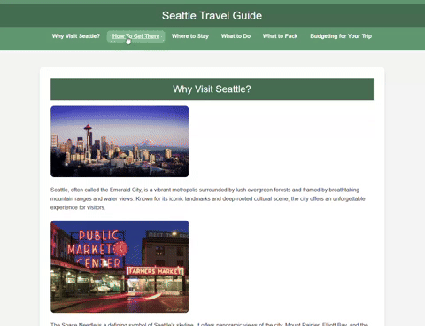

# travel-guide

## Overview
Welcome to my Seattle Travel Guide! This project is inspired by my amazing vacation in Seattle, a city that left an indelible mark on me with its vibrant atmosphere, stunning natural beauty, and rich cultural experiences.

## Why I Created This Guide
During my vacation, Seattle left an unforgettable impression on me. I loved everything from the lush greenery surrounding the city to the incredible food and lively culture. Whether you’re interested in nature, history, or just want to explore a new city, I hope this guide helps make your trip as memorable as mine was. My goal is to offer practical tips and recommendations to ensure you get the most out of your visit.

## Features
- **Why Visit Seattle**: Highlights some of Seattle’s must-see landmarks like the Space Needle, Pike Place Market, and more.
- **How To Get There**: Provides useful information about Seattle-Tacoma International Airport (SEA) and how to navigate the city via public transport.
- **Where To Stay**: Suggests a variety of accommodation options in different neighborhoods based on your preferences.
- **What To Do**: Recommends activities for all kinds of travelers, from cultural landmarks to local hidden gems.
- **What To Pack**: Offers tips on how to pack smart for Seattle’s unpredictable weather.
- **Budgeting for Your Trip**: Includes advice on how to manage expenses during your stay.

## How to Use
Visit [Seattle Travel Guide](https://rbracker.github.io/travel-guide/) to explore the guide and start planning your Seattle adventure. 

See Below for a sneek peek at my travel guide webpage

## Elemental Forecast Project

For a unique look into weather forecasting, check out my [Elemental Forecast project](https://rbracker.github.io/elemental-forecast/). This tool can help you plan for Seattle's unpredictable weather patterns, ensuring you're always prepared!

## License
This project is open-source and licensed under the MIT License.